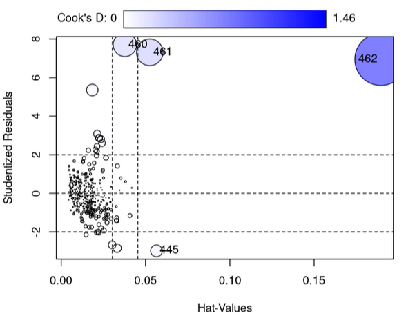
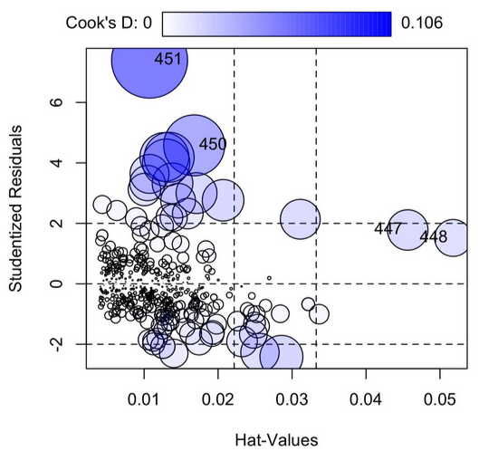
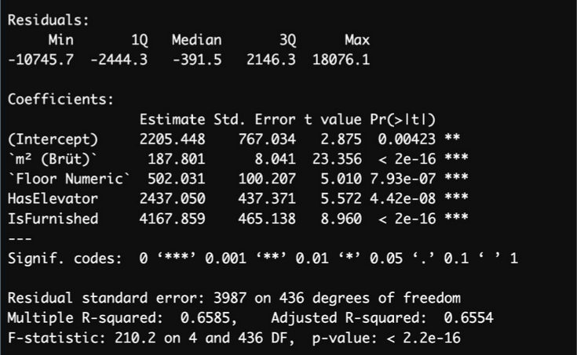
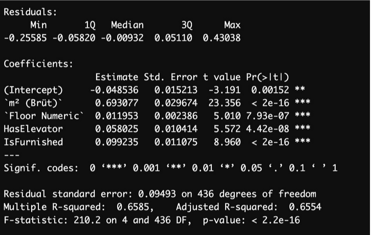

# Analysis of Real Estate Data in Mecidiyeköy, İstanbul
Scraped real estate data from sahibinden.com and analyzed using multiple linear regression and logistic regression to determine how various factors like size, room count, and building age influence apartment prices.

## Description
Scraped data from sahibinden.com using Python for apartments in Mecidiyeköy, İstanbul. Focusing on factors such as square meter, room count, building age, floor number, total floors, number of bathrooms, balconies, elevator, parking, furniture, dues, and deposits. 

Multiple linear regression and logistic regression were used to analyze the impact of these factors on apartment prices. Outliers, influence points, and leverage points were identified and and did what is necessary. Furthermore, data transformations applied to improve model performance. The model was evaluated using R-squared and MSE, providing insights into the key factors influencing real estate prices in the area.

Below, you can find plots and summary images from the analysis.

 Before taking action for outliers and influence points. 

  

 

 After taking action for outliers and influence points. 

  

 

 Model summary. 

  

 

 Model summary after transformation, including only the best cofactors. 

  

